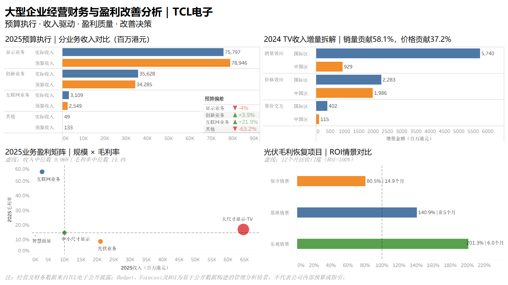

# 大型企业经营财务与盈利改善分析｜TCL电子

> 面向 FP&A / 财务BP / 经营财务 / 财务分析岗位的经营财务案例。  
> 基于 TCL 电子公开经营及财务数据，模拟“预算执行 → 收入驱动 → 盈利质量 → 改善决策”的管理分析流程。



## 项目概览

本项目不是传统财务报表比率分析，而是从企业经营管理视角出发，尝试回答四个问题：

1. **预算执行：** 各业务实际收入与管理预算情景相比表现如何？
2. **收入驱动：** TV 业务增长主要来自销量、价格还是量价共同作用？
3. **盈利质量：** 哪些业务兼具规模与盈利能力，哪些业务存在利润质量改善空间？
4. **改善决策：** 若针对低毛利业务实施改善项目，投资回报和回收期是否具有可行性？

**分析期间：** 2022FY–2026H1  
**主要工具：** Excel、Tableau  
**金额口径：** 百万港元（HK$m）

---

## 分析框架

```text
公开经营/财务数据
      ↓
历史Actual整理
      ↓
Budget / Forecast管理情景
      ↓
Actual vs Budget偏差分析
      ↓
Price / Volume收入驱动拆解
      ↓
成本率 / 毛利率 / 业务盈利矩阵
      ↓
改善项目收益投入比 / Payback / Breakeven
      ↓
经营决策建议
```

---

## 核心发现

### 1. 预算执行：总体接近预算，但业务表现分化

基于历史经营表现构建 2025 Case Budget，并与 2025 Actual 进行比较：

- 2025 实际收入较 Case Budget **低约 1.1%**；
- 显示业务低于预算约 **4.0%**；
- 创新业务高于预算约 **3.9%**；
- 互联网业务高于预算约 **21.9%**；
- 其他业务低于预算约 **63.2%**。

> 预算偏差并非均匀分布，后续分析需要进一步定位至具体业务与区域。

### 2. 收入驱动：整体以销量为主，中国区更偏价格驱动

对 2024 年 TV 业务收入增量进行 Price-Volume 拆解：

- **销量效应贡献约 58.1%**；
- **价格效应贡献约 37.2%**；
- 其余为量价交互及少量残差。

区域层面表现不同：

- **中国区：Price-led**，价格/产品结构升级贡献更突出；
- **国际区：Volume-led**，销量扩张是主要增长来源。

### 3. 盈利质量：规模与毛利率不能只看一个维度

通过“收入规模 × 毛利率”业务盈利矩阵进行比较：

- **大尺寸显示 / TV：** 规模最大且贡献主要毛利，为核心利润引擎；
- **互联网业务：** 规模较小，但 2025 毛利率约 **56.3%**，属于高毛利业务；
- **光伏业务：** 收入规模增长较快，但 2025 毛利率约 **8.6%**，盈利质量存在改善空间；
- 中小尺寸显示及智慧商显处于相对中低规模 / 中低毛利区间，需要关注增长质量与效率。

### 4. 改善决策：三种毛利恢复情景是怎样算出来的？

选择光伏业务作为经营改善案例。这里的核心不是预测 TCL 一定会实现某个结果，而是把已观察到的毛利率下降转化成一个可计算的管理情景。

#### 4.1 先确定真实基线

2025 年光伏业务公开数据：

- 收入：**HK$21,063m**
- 2025 毛利率：约 **8.59%**
- 2024 毛利率：约 **9.60%**

因此，2024 → 2025 的毛利率缺口为：

```text
毛利率缺口 = 9.60% - 8.59% = 1.01 p.p.
```

这 **1.01 p.p.** 是三种情景的上限依据，而不是随意拍出的改善目标。

#### 4.2 再把“恢复多少毛利率缺口”设成三种情景

| 情景 | 假设 | 成本率改善 / 毛利率恢复 |
|---|---|---:|
| 保守情景 | 只恢复历史缺口的 40% | **0.40 p.p.** |
| 基准情景 | 恢复历史缺口的 70% | **0.70 p.p.** |
| 乐观情景 | 恢复历史缺口的 100% | **1.01 p.p.** |

计算公式：

```text
情景改善幅度 = 1.01 p.p. × 情景恢复比例
```

由于：

```text
毛利率 = 1 - 成本率
```

所以“毛利率提高 0.70 p.p.”也可以理解为“成本率下降 0.70 p.p.”。

#### 4.3 年度增量毛利如何计算？

项目假设 **收入不增长**，只看成本率改善带来的利润效果，因此：

```text
年度增量毛利 = 2025收入 × 成本率改善幅度
```

对应结果：

| 情景 | 成本率改善 | 年度增量毛利 |
|---|---:|---:|
| 保守 | 0.40 p.p. | **约 HK$84.8m** |
| 基准 | 0.70 p.p. | **约 HK$148.4m** |
| 乐观 | 1.01 p.p. | **约 HK$212.0m** |

例如基准情景：

```text
HK$21,063m × 0.7047% ≈ HK$148.4m
```

#### 4.4 项目投入如何设定？

由于公开资料没有 TCL 内部的真实改善项目预算，本项目将一次性项目投入设为：

```text
项目投入 = 2025光伏收入 × 0.5%
         = HK$21,063m × 0.5%
         ≈ HK$105.3m
```

**0.5% 是 S 类管理情景假设，不是公司公开披露数据。**

可理解为采购优化、项目筛选、交付效率与管理机制改善所需的一次性资源投入。

#### 4.5 Dashboard 中的“ROI”是什么口径？

当前 Dashboard 中标为 ROI 的指标计算为：

```text
年度收益投入比 = 年度增量毛利 ÷ 项目投入
```

因此：

| 情景 | 年度增量毛利 | 项目投入 | Dashboard“ROI” |
|---|---:|---:|---:|
| 保守 | HK$84.8m | HK$105.3m | **80.5%** |
| 基准 | HK$148.4m | HK$105.3m | **140.9%** |
| 乐观 | HK$212.0m | HK$105.3m | **201.3%** |

> **口径说明：** 这个指标更准确地说是“年度收益投入比（Benefit / Investment）”。Dashboard 为简洁起见使用了 ROI 标签。若采用更严格的“净 ROI =（收益－投入）÷投入”口径，则基准情景约为 **40.9%**。面试或正式财务表达中应说明所采用的 ROI 定义。

#### 4.6 回收期如何计算？

```text
回收期（月） = 项目投入 ÷（年度增量毛利 ÷ 12）
```

结果：

- 保守情景：约 **14.9个月**
- 基准情景：约 **8.5个月**
- 乐观情景：约 **6.0个月**

因此，Dashboard 中的 100% 虚线表示：

> **年度增量毛利 = 项目投入，即约 12 个月收回投入。**

#### 4.7 为什么 12 个月回收门槛是 0.50 p.p.？

要在一年内收回 HK$105.3m 的项目投入，年度增量毛利至少也要达到 HK$105.3m：

```text
所需成本率改善 = HK$105.3m ÷ HK$21,063m
               = 0.50%
               = 0.50 p.p.
```

因此：

> 若管理层无法识别出至少 **0.50 p.p.** 的可信成本率改善空间，则该项目无法在 12 个月内收回假设投入；若能达到基准情景约 **0.70 p.p.**，则回收期约为 **8.5个月**。

这一步的价值是把“建议降本增效”转化为可量化的收益、投入和决策门槛。

---

## 数据与假设边界

为避免将模拟管理数据误表述为企业内部数据，本项目将数据分为三类：

| 类型 | 含义 | 示例 |
|---|---|---|
| **R — Reported** | 公司公开披露的真实经营/财务数据 | 收入、出货量、毛利率等 |
| **D — Derived** | 基于公开数据通过公式计算得到 | 毛利、成本率、驱动效应等 |
| **S — Scenario** | 为管理分析构造的情景假设 | Budget、Forecast、项目投入、ROI情景 |

**重要说明：**

- 本项目未使用 TCL 内部预算、内部经营台账或非公开数据；
- Budget、Forecast 与 ROI 为基于公开数据构建的管理分析情景；
- 情景结果用于展示 FP&A / 财务BP 的分析方法，不代表 TCL 公司指引或真实内部决策。

---

## Dashboard 结构

| 模块 | 主要问题 | 方法 |
|---|---|---|
| 预算执行 | 实际表现与计划差多少？ | Budget vs Actual、偏差率 |
| 收入驱动 | 收入变化为什么发生？ | Price / Volume / Interaction |
| 盈利质量 | 哪些业务真正创造利润？ | 收入规模 × 毛利率盈利矩阵 |
| 改善决策 | 改善项目值不值得做？ | 收益投入比（Dashboard标注ROI）、Payback、Breakeven |

---

## 项目文件

- [最终 Tableau Dashboard（PNG）](CASE2_经营财务分析看板.png)
- [Tableau 打包工作簿（TWBX）](CASE2_TCL_经营财务与盈利改善分析.twbx)
- [Tableau 数据源（XLSX）](CASE2_Tableau_DataSource.xlsx)

---

## 可迁移能力

该案例虽然以 TCL 电子为样本，但分析框架可迁移到大型制造、科技、消费、零售、物流及其他实体企业的经营财务场景：

- Budget / Forecast
- Actual vs Budget
- 收入驱动分析
- 成本与毛利分析
- 业务盈利能力评价
- 改善项目收益投入比、ROI口径与回收期测算
- 管理层决策支持

---

## 项目定位

本项目用于展示以下岗位相关能力：

**FP&A｜财务BP｜经营财务｜财务分析｜财务管培｜经营分析**

核心能力链条：

> **识别经营偏差 → 定位驱动因素 → 判断盈利质量 → 量化改善方案 → 支持管理决策**
